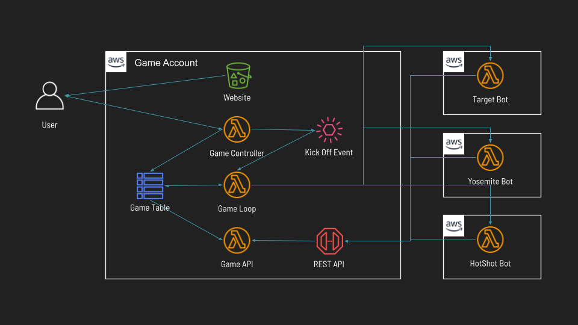
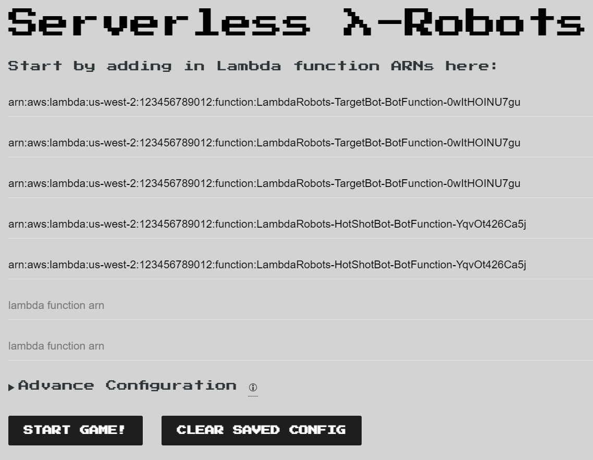
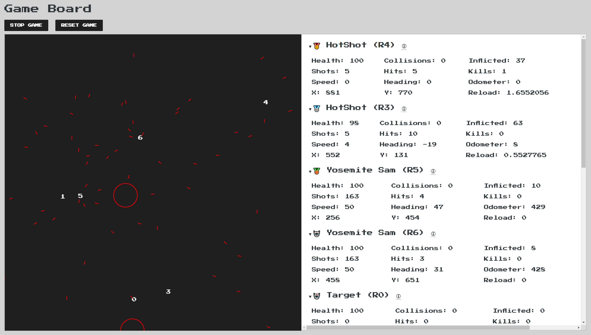

# λ-Robots

In λ-Robots (pronounced _Lambda Robots_), you build a battle bot that participates on a square game field. Each turn, the server invokes your bot's Lambda function to get its action for the next turn until either your bot wins, is destroyed, or time runs out.

λ-Robots is a port of the 80s [P-Robots](https://www.dosgames.com/game/p-robots/) game to AWS Serverless .NET using [LambdaSharp](https://lambdasharp.net).

## Prerequisites

To get started, you must complete the followings steps.
1. [Create an AWS Account](https://aws.amazon.com)
1. [Install .NET 5 for LambdaSharp](https://dotnet.microsoft.com/download)
1. [Setup LambdaSharp](https://lambdasharp.net/#install-lambdasharp-cli)

## Deploy the Game

Use LambdaSharp to deploy the `LambdaRobots.Game` module to your AWS account.
```bash
lash deploy LambdaRobots.Game:2.0@lambdasharp
```

This will create an S3 bucket for the game website, several Lambda functions for the game logic, and a DynamoDB table for the game state, as shown in this diagram. The battle bots can be deployed to any account, but must be in the same AWS region.



## Deploy the Battle Bots

λ-Robots includes three bots that can be deployed to try out the game and challenge your own bot.

<dl>

<dt>Target Bot</dt>
<dd>

Target Bot is a stationary bot that does not move or shoot. This bot is perfect target practice for other bots.

<details>
<summary>Build Configuration</summary>

|Field  |Value  |
|-------|-------|
|Name   |Target
|Armor  |Medium
|Engine |Economy
|Missile|Dart
|Radar  |Ultra Short Range

</details>

_Deploy_
```bash
lash deploy LambdaRobots.TargetBot:2.0@lambdasharp
```
</dd>

<dt>Yosemite Sam Bot</dt>
<dd>

Yosemite Sam Bot runs in random directions across the board, unloading its missiles as fast as it can. This bot does not aim and travels in straight lines from edge to edge.

<details>
<summary>Build Configuration</summary>

|Field  |Value  |
|-------|-------|
|Name   |Yosemite Sam
|Armor  |Medium
|Engine |ExtraLarge
|Missile|Dart
|Radar  |Mid Range

</details>

_Deploy_
```bash
lash deploy LambdaRobots.YosemiteSamBot:2.0@lambdasharp
```

</dd>

<dt>HotShot Bot</dt>
<dd>

HotShot Bot uses the `Scan` API to locate other bots before taking aim. It uses internal state to progressively refines its aim over time, making it very deadly to stationary targets. When HotShot is hit, it moves to a new random location to evade further damage.

<details>
<summary>Build Configuration</summary>

|Field  |Value  |
|-------|-------|
|Name   |HotShot
|Armor  |Medium
|Engine |Compact
|Missile|Javelin
|Radar  |Long Range

</details>

_Deploy_
```bash
lash deploy LambdaRobots.HotShotBot:2.0@lambdasharp
```

</dd>

</dl>

## Starting the Game

Navigate to the URL shown at the end of the `LambdaRobots.Game` deployment. It will load the game configuration page where the ARNs for the battle bot can be entered. The same ARN can be used more than once as it represents a different instance of the same bot.

In this screenshot, the game is configured to initialize with 3 Target bots and 2 HotShot bots.



Click `Start Game` to initialize the bots and see the match unfold.


